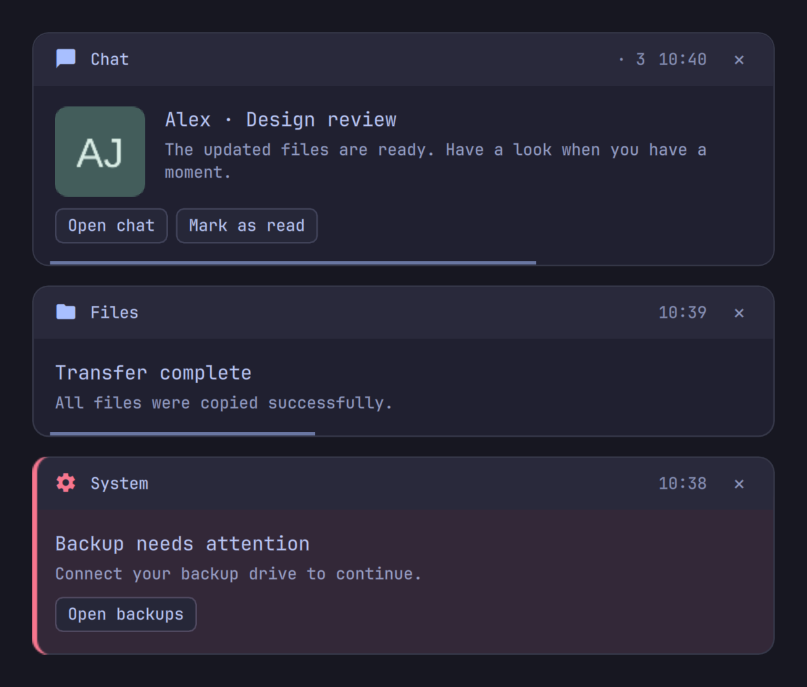

# Foamy Notifications

Compact notification popups for Omarchy Quattro, styled to match
[Foamy Notification Center](https://github.com/foamrider/foamy-notification-center).



## Install

Requires Omarchy Quattro, Quickshell, Python 3, and the standard Omarchy tools
(including `hyprctl` and `omarchy-shell`). Notification Center is optional.

```sh
omarchy plugin add https://github.com/foamrider/foamy-notifications.git --enable
omarchy restart shell
```

Enabling the plugin replaces `omarchy.notifications`. Run only one notification
server. The existing Omarchy notification commands and do-not-disturb control
continue to work.

## Use

- App icons stay in a slim header; sender images appear beside the message.
- Hover to pause the timer. A smooth, optional line shows the remaining time.
- Left-click or use an action to handle a notification and remove it from history.
  Right-click or × hides the popup and keeps it in history.
- Exact duplicates share a card. Overflow goes to history.
- Critical alerts have a colored edge and stay until dismissed by default.
- Cards fade in and out. While the pointer is inside the stack, expired cards
  leave their space in place so the hovered card does not move away.

Configure timeout, compact layout, images, monitor placement, fullscreen
suppression, and browser app matching in `shell.json`. See
[configuration and validation](CONFIGURATION.md) for all settings and checks.

Actions supplied by an app work while that app is connected. Restored messages
cannot recover old app callbacks. Failed actions keep the notification available
for retry. The center retains its own history and optional image previews.

Notification Center can invoke a live default action through
`foamy.notifications invokeDefault <timestamp-id>`. The method returns `invoked`,
`unavailable`, `busy`, or `invalid`. It accepts only an exact current notification
key, never archived commands, and handles that notification without clearing its
whole duplicate group. Expired and restored callbacks return `unavailable` so the
center can fall back to focusing the sending app.

## Remove

```sh
omarchy plugin remove foamy.notifications
omarchy restart shell
```

Removing an enabled plugin restores stock notifications. If you disabled it
first, explicitly enable `omarchy.notifications`. History and do-not-disturb
state remain on disk. Omarchy manages the plugin entry in `shell.json`; packages
and data outside the plugin directory remain in place.

## License

[MIT](LICENSE), with [Omarchy attribution](LICENSE-OMARCHY).
The preview uses synthetic messages and an original sample avatar.

Provided **as is**, without warranty or guaranteed support. Use at your own risk.
